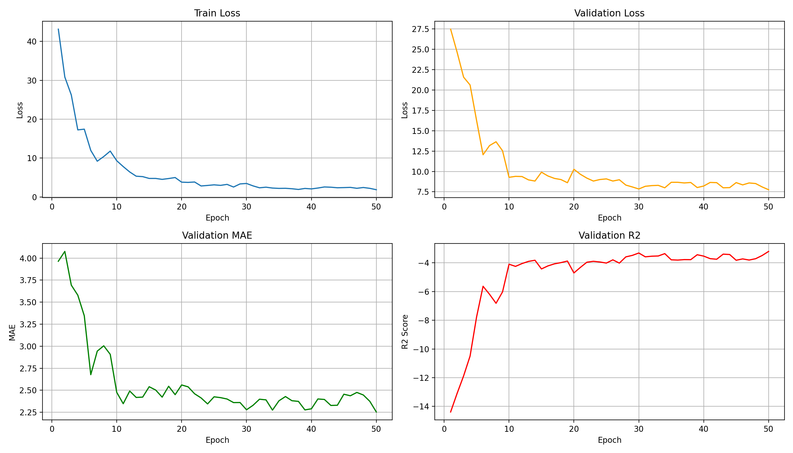

# 打乱数据顺序的训练结果-拼接后的数据
## 包含convenext、densenet等9个模型
1. 训练结果保存在`runs/`文件夹下
## 图片
runs_convnext_tiny

runs_densenet121

runss_efficientnet_b0

runs_mobilenet_v3_large

runs_resnet50

runs_resnext50_32x4d

runs_swin_tiny_patch4_window7_224

runs_vgg16

runs_vit_base_patch16_224

## 训练结果 yolo8、11
1. 训练结果保存在`runs/`文件夹下
## 图片
runs_yolo8n50

runs-yolov11-50

