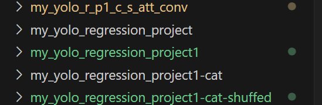

## 说明
在该文件夹下面主要有

## my_yolo_regression_project->这是最初的测试文件夹
## my_yolo_regression_project1->这是只使用正面数据进行训练结果（没有打乱顺序）
## my_yolo_regression_project1-cat-shuffed->这是使用正反拼接数据进行训练结果，并且打乱顺序
## my_yolo_r_p1_c_s_att_conv->这是使用正反拼接数据进行训练结果，并且打乱顺序，添加了注意力机制和卷积模块
